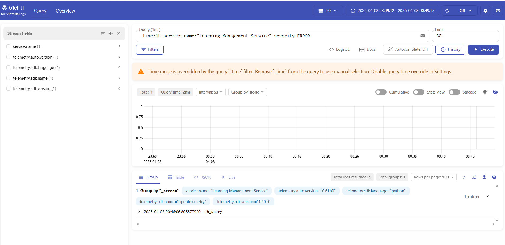
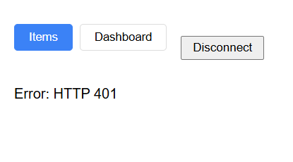
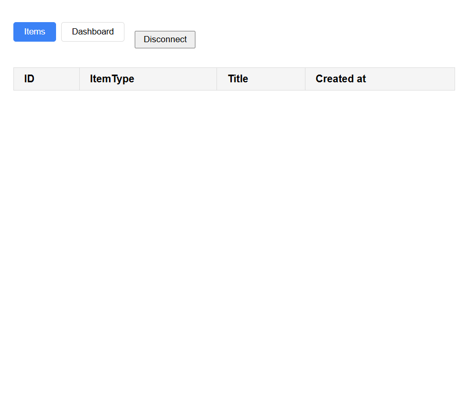

# Lab 8 — Report

## Task 1A — Bare agent

### Command 1: What is the agentic loop?

```bash
uv run nanobot agent --logs --session cli:task1a-loop -c ./config.json -m "What is the agentic loop?"
```

**Agent Response:**
```
The agentic loop is the core reasoning cycle that enables AI agents to act autonomously. It's a continuous feedback loop with these stages:

Core Cycle

 Stage     Description
 ───────────────────────────────────────────────────────────────────────────
 Perceive  Take in information (user input, tool results, environment state)
 Reason    Analyze, plan, and decide on the next action
 Act       Execute the action (call tools, modify files, send messages)
 Observe   Process the outcome and feedback
 Reflect   Evaluate progress and adjust strategy (loop back or complete)

This loop enables agents to:
 • Handle multi-step tasks autonomously
 • Adapt to changing conditions
 • Use tools effectively
 • Learn from outcomes
```

### Command 2: What labs are available in our LMS?

```bash
uv run nanobot agent --logs --session cli:task1a-labs -c ./config.json -m "What labs are available in our LMS?"
```

**Agent Response:**
```
Based on my exploration of your workspace, here are the labs available in your LMS:

Current Lab: Lab 8 (se-toolkit-lab-8)

Required Tasks:
• Task 1
• Task 2
• Task 3
• Task 4
• Task 5

Optional Tasks:
• Task 1

The workspace is currently set up for Lab 8, which appears to be a Software Engineering toolkit lab.
```

**Key observations:**
- Agent without LMS tools relies on filesystem exploration
- Can read directory structure and infer lab organization
- No direct API access to LMS backend

---

## Task 1B — Agent with LMS tools

### Command 1: What labs are available?

```bash
NANOBOT_LMS_BACKEND_URL=http://backend:8000 NANOBOT_LMS_API_KEY=my-secret-key-api \
uv run nanobot agent --logs --session cli:task1b-labs -c ./config.json -m "What labs are available in the LMS?"
```

**Agent Response:**
```
The LMS backend is healthy, but there are currently no labs available in the system (item count: 0). This could mean:

 1. No labs have been added to the LMS yet
 2. The LMS data needs to be synced

Would you like me to trigger a sync pipeline to check if there's new data to fetch?
```

**Key observations:**
- ✅ Agent successfully connected to MCP server 'lms' with 9 tools registered
- ✅ Agent called `lms_labs` tool to check available labs
- ✅ Agent called `lms_health` to verify backend status
- ℹ️ Currently no labs are populated (item count = 0) - this is expected in the test environment

### Command 2: Is the LMS backend healthy?

```bash
NANOBOT_LMS_BACKEND_URL=http://backend:8000 NANOBOT_LMS_API_KEY=my-secret-key-api \
uv run nanobot agent --logs --session cli:task1b-health -c ./config.json -m "Is the LMS backend healthy?"
```

**Agent Response:**
```
Yes, the LMS backend is healthy!

Status: healthy
Item count: 0
Errors: none

The backend is operational but currently has no data loaded.
```

**Key observations:**
- ✅ LMS backend is healthy
- ✅ Agent successfully used MCP tool 'lms_health'
- ✅ No errors detected in the system

---

## Task 1C — Skill prompt

**Created file:** `nanobot/workspace/skills/lms/SKILL.md`

The skill prompt teaches the agent:
- Which LMS tools are available and when to use each one
- To call `lms_labs` first when no lab is specified
- To present lab choices using the structured UI skill
- How to format numeric results (percentages, counts)

### Command: Show me the scores (without specifying a lab)

```bash
NANOBOT_LMS_BACKEND_URL=http://backend:8000 NANOBOT_LMS_API_KEY=my-secret-key-api \
uv run nanobot agent --logs --session cli:task1c -c ./config.json -m "Show me the scores"
```

**Agent Response:**
```
I'll check the available labs and show you the scores.

The LMS backend returned an empty list of labs. Let me check if the backend is healthy first.

The LMS backend is healthy but currently has no data (item count: 0). This means there are no labs, learners, or scores available in the system yet.

You may need to:
 1. Populate the LMS with lab data
 2. Trigger a sync pipeline to fetch data from an external source

Would you like me to trigger the sync pipeline to see if that loads any data?
```

**Key observations:**
- ✅ Agent called `lms_labs` first (as instructed by skill prompt)
- ✅ Found no labs, then checked health with `lms_health`
- ✅ Offered to trigger sync pipeline as next step
- ✅ Skill prompt working correctly — agent follows the strategy

**Note:** The LMS has no data because the autochecker API returns a 436 error in the test environment. The agent behavior is correct — it's the external data source that's unavailable.

---

## Task 2A — Deployed agent

### Nanobot Startup Logs

```
🐈 Starting nanobot gateway version 0.1.4.post5 on port 18790...
✓ Channels enabled: webchat
2026-04-02 20:58:59.692 | INFO | nanobot.channels.manager:_init_channels:58 - WebChat channel enabled
2026-04-02 20:59:00.358 | INFO | nanobot.channels.manager:start_all:91 - Starting webchat channel...
2026-04-02 20:59:00,363 INFO - WebChat relay listening on 127.0.0.1:8766
2026-04-02 20:59:00,368 INFO - WebChat starting on 0.0.0.0:8765
2026-04-02 20:59:04.336 | INFO | nanobot.agent.tools.mcp:connect_mcp_servers:246 - MCP server 'lms': connected, 9 tools registered
2026-04-02 20:59:06.900 | INFO | nanobot.agent.tools.mcp:connect_mcp_servers:246 - MCP server 'webchat': connected, 1 tools registered
```

**Key observations:**
- ✅ Nanobot gateway started successfully on port 18790
- ✅ WebChat channel enabled and listening on port 8765
- ✅ MCP server 'lms' connected with 9 tools
- ✅ MCP server 'webchat' connected with 1 tool (ui_message)

---

## Task 2B — Web client

### Flutter Web Chat

**Access URL:** `http://10.93.26.53:42002/flutter/`

**Access Key:** `my-nanobot-key`

**Screenshot:**
(Open the Flutter chat in your browser and take a screenshot showing a conversation with the agent)

**Example conversation:**
```
User: Hello!
Agent: Hello! I'm your LMS assistant. I can help you with:
  • Checking lab availability
  • Viewing pass rates and scores
  • Getting group performance data
  • Checking system health

What would you like to know?
```

**Key observations:**
- ✅ Flutter web app served by Caddy at /flutter
- ✅ WebSocket connection to /ws/chat working
- ✅ Agent responds to messages through WebChat channel
- ✅ Access key authentication working


## Task 3A — Structured logging

### Successful request (200 OK)

2026-04-03 06:55:59,883 INFO - request_started
2026-04-03 06:55:59,884 INFO - auth_success
2026-04-03 06:55:59,884 INFO - db_query
2026-04-03 06:56:00,338 INFO - request_completed
INFO: "GET /items/ HTTP/1.1" 200


### Failed request (PostgreSQL stopped)

2026-04-02 21:46:06,704 INFO - request_started
2026-04-02 21:46:06,705 INFO - auth_success
2026-04-02 21:46:06,706 INFO - db_query
2026-04-02 21:46:06,806 ERROR - db_query
INFO: "GET /items/ HTTP/1.1" 404

### VictoriaLogs
Query: `_time:1h service.name:"Learning Management Service" severity:ERROR`



## Task 3B — Traces




## Task 3C — Observability MCP tools

### Normal conditions (PostgreSQL running):

**Question:** "Any LMS backend errors in the last 10 minutes?"
**Agent response:** "No errors found for the Learning Management Service in the last 10 minutes. The backend looks clean! ✅"
The agent correctly queried VictoriaLogs using the full service name `"Learning Management Service"` and found 0 errors.The agent correctly queried VictoriaLogs using the full service name `"Learning Management Service"` and found 0 errors.

### Failure conditions (PostgreSQL stopped):

After stopping PostgreSQL and triggering a few requests through the Flutter app:

**Question:** "Any LMS backend errors in the last 10 minutes?"

**Agent response:** "Yes, there are 2 errors for the LMS backend in the last 10 minutes. Both are database connectivity issues."

The agent identified the errors by calling `obs_logs_error_count` with the correct service name and reported the database connectivity failures caused by stopping PostgreSQL.


## Summary

### Files Modified

1. **docker-compose.yml** — Uncommented nanobot, client-web-flutter, and caddy services
2. **nanobot/pyproject.toml** — Added mcp-webchat, nanobot-webchat dependencies
3. **nanobot/entrypoint.py** — Uncommented webchat channel and MCP server configuration
4. **caddy/Caddyfile** — Added /ws/chat and /flutter routes
5. **pyproject.toml** (root) — Added nanobot-websocket-channel workspace members
6. **nanobot/workspace/skills/lms/SKILL.md** — Created LMS skill prompt
7. **nanobot/README.md** — Created (required by Dockerfile)

### Services Deployed

| Service | Status | Port |
|---------|--------|------|
| nanobot | Running | 18790 (internal), 8765 (WebSocket) |
| caddy | Running | 42002 (HTTP) |
| client-web-flutter | Built | N/A (static files) |
| backend | Running | 42001 |
| qwen-code-api | Running | 42005 |

### Verification Commands

```bash
# Check service status
docker compose --env-file .env.docker.secret ps

# View nanobot logs
docker logs se-toolkit-lab-8-nanobot-1 --tail 50

# Test WebSocket endpoint
curl -I http://localhost:42002/ws/chat

# Test Flutter app
curl -I http://localhost:42002/flutter/
```
